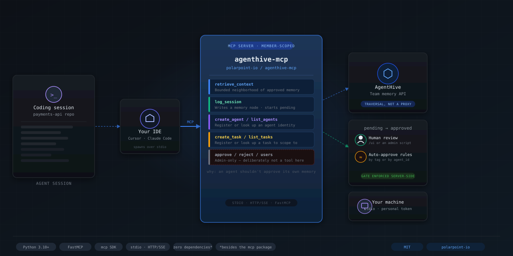

# agenthive-mcp



[](https://github.com/polarpoint-io/agenthive-mcp/actions/workflows/ci.yml)
[](LICENSE)

A Model Context Protocol (MCP) server that exposes [AgentHive](https://github.com/polarpoint-io/agenthive)'s shared, reviewed team memory to LLM clients (Claude Desktop, Claude Code, Cursor, VS Code, etc.) - `retrieve_context`, `log_session`, `create_agent`, `list_agents`, `create_task`, and `list_tasks` as native tools, instead of a `CLAUDE.md` / `.cursor/rules` instruction block that calls AgentHive's HTTP API by hand.

> **PyPI**: `pip install agenthive-mcp` &nbsp;·&nbsp; **Image**: `ghcr.io/polarpoint-io/agenthive-mcp:latest` &nbsp;·&nbsp; **Repo**: <https://github.com/polarpoint-io/agenthive-mcp>

## Table of contents

- [Quick start](#quick-start)
- [Configuration](#configuration)
- [Client integrations](#client-integrations)
- [Tool reference](#tool-reference)
- [Wiring an agent up to actually use these tools](#wiring-an-agent-up-to-actually-use-these-tools)
- [Why a separate repo from AgentHive](#why-a-separate-repo-from-agenthive)
- [Running from source](#running-from-source)
- [Development](#development)
- [Publishing](#publishing)
- [Security notes](#security-notes)


## Quick start

You need an AgentHive team and a personal token first - see [AgentHive's onboarding guide](https://github.com/polarpoint-io/agenthive/blob/main/ONBOARDING.md) if you don't have one yet.

### 1. pip (no Docker)

```bash
pip install agenthive-mcp
export AGENTHIVE_URL=https://your-agenthive-host
export AGENTHIVE_TOKEN=your_personal_token
export AGENTHIVE_TEAM_ID=your_team_id

agenthive-mcp                                 # stdio
TRANSPORT=http HTTP_PORT=8000 agenthive-mcp   # HTTP/SSE
```

### 2. Docker (stdio — launched by your MCP client)

```bash
docker pull ghcr.io/polarpoint-io/agenthive-mcp:latest

docker run --rm -i \
  -e AGENTHIVE_URL=https://your-agenthive-host \
  -e AGENTHIVE_TOKEN=your_personal_token \
  -e AGENTHIVE_TEAM_ID=your_team_id \
  ghcr.io/polarpoint-io/agenthive-mcp:latest
```

### 3. Docker (HTTP/SSE — standalone service)

```bash
docker run --rm \
  -p 8000:8000 \
  -e AGENTHIVE_URL=https://your-agenthive-host \
  -e AGENTHIVE_TOKEN=your_personal_token \
  -e AGENTHIVE_TEAM_ID=your_team_id \
  -e TRANSPORT=http \
  ghcr.io/polarpoint-io/agenthive-mcp:latest
# SSE endpoint: http://localhost:8000/sse
```

Use your own token, not a shared or admin one - whatever it can do (`member` or `admin`) is what this server can do on your behalf, nothing more or less (see [Security notes](#security-notes)).


## Configuration

| Variable | Required | Default | Description |
|---|---|---|---|
| `AGENTHIVE_URL` | yes | — | Base URL of a running AgentHive service |
| `AGENTHIVE_TOKEN` | yes | — | Your personal AgentHive token |
| `AGENTHIVE_TEAM_ID` | yes | — | Your AgentHive team id |
| `TRANSPORT` | no | `stdio` | `stdio` or `http` |
| `HTTP_HOST` | no | `0.0.0.0` | Bind host (HTTP mode) |
| `HTTP_PORT` | no | `8000` | Bind port (HTTP mode) |
| `LOG_LEVEL` | no | `INFO` | Python log level |

See [`.env.example`](.env.example) for a copy-pasteable template.


## Client integrations

Each client supports two transport options — **pip** (recommended, no Docker required) or **Docker**.

```bash
# Install once
pip install agenthive-mcp
```

---

### Claude Desktop

Edit `~/Library/Application Support/Claude/claude_desktop_config.json` (macOS) or `%APPDATA%\Claude\claude_desktop_config.json` (Windows).

**pip (recommended)**
```json
{
  "mcpServers": {
    "agenthive": {
      "command": "agenthive-mcp",
      "env": {
        "AGENTHIVE_URL": "https://your-agenthive-host",
        "AGENTHIVE_TOKEN": "your_personal_token",
        "AGENTHIVE_TEAM_ID": "your_team_id"
      }
    }
  }
}
```

**Docker**
```json
{
  "mcpServers": {
    "agenthive": {
      "command": "docker",
      "args": [
        "run", "--rm", "-i",
        "-e", "AGENTHIVE_URL", "-e", "AGENTHIVE_TOKEN", "-e", "AGENTHIVE_TEAM_ID",
        "ghcr.io/polarpoint-io/agenthive-mcp:latest"
      ],
      "env": {
        "AGENTHIVE_URL": "https://your-agenthive-host",
        "AGENTHIVE_TOKEN": "your_personal_token",
        "AGENTHIVE_TEAM_ID": "your_team_id"
      }
    }
  }
}
```

Restart Claude Desktop after editing. You should see a hammer icon in the chat confirming the `agenthive` server is connected with all 6 tools available.

---

### Claude Code

**pip (recommended)**
```bash
pip install agenthive-mcp

claude mcp add agenthive -- agenthive-mcp
# then export your config before running claude:
export AGENTHIVE_URL=https://your-agenthive-host
export AGENTHIVE_TOKEN=your_personal_token
export AGENTHIVE_TEAM_ID=your_team_id
```

**Docker**
```bash
claude mcp add agenthive -- docker run --rm -i \
  -e AGENTHIVE_URL -e AGENTHIVE_TOKEN -e AGENTHIVE_TEAM_ID \
  ghcr.io/polarpoint-io/agenthive-mcp:latest
```

Or a plain `.mcp.json` in the repo root works too - same shape as Claude Desktop's config above.

---

### Cursor

Edit `~/.cursor/mcp.json`:

**pip (recommended)**
```json
{
  "mcpServers": {
    "agenthive": {
      "command": "agenthive-mcp",
      "env": {
        "AGENTHIVE_URL": "https://your-agenthive-host",
        "AGENTHIVE_TOKEN": "your_personal_token",
        "AGENTHIVE_TEAM_ID": "your_team_id"
      }
    }
  }
}
```

**Docker**
```json
{
  "mcpServers": {
    "agenthive": {
      "command": "docker",
      "args": ["run", "--rm", "-i",
               "-e", "AGENTHIVE_URL", "-e", "AGENTHIVE_TOKEN", "-e", "AGENTHIVE_TEAM_ID",
               "ghcr.io/polarpoint-io/agenthive-mcp:latest"],
      "env": {
        "AGENTHIVE_URL": "https://your-agenthive-host",
        "AGENTHIVE_TOKEN": "your_personal_token",
        "AGENTHIVE_TEAM_ID": "your_team_id"
      }
    }
  }
}
```

---

### VS Code (Continue)

Edit `~/.continue/config.json`:

**pip (recommended)**
```json
{
  "mcpServers": [{
    "name": "agenthive",
    "command": "agenthive-mcp",
    "env": {
      "AGENTHIVE_URL": "https://your-agenthive-host",
      "AGENTHIVE_TOKEN": "your_personal_token",
      "AGENTHIVE_TEAM_ID": "your_team_id"
    }
  }]
}
```

---

### HTTP / SSE (remote or shared server)

If you prefer to run the server as a persistent HTTP service rather than a subprocess - still bound to whichever token you start it with, this is a transport choice, not a different auth model:

```bash
# pip
pip install agenthive-mcp
AGENTHIVE_URL=... AGENTHIVE_TOKEN=... AGENTHIVE_TEAM_ID=... TRANSPORT=http HTTP_PORT=8000 agenthive-mcp

# Docker
docker run --rm -p 8000:8000 \
  -e AGENTHIVE_URL=... -e AGENTHIVE_TOKEN=... -e AGENTHIVE_TEAM_ID=... \
  -e TRANSPORT=http \
  ghcr.io/polarpoint-io/agenthive-mcp:latest
```

Then point your MCP client at `http://localhost:8000/sse`.


## Tool reference

Every tool here is a **member**-role AgentHive call - the same tier your personal token already grants over the API directly. Admin-only calls (`list_pending`/`approve`/`reject`, user management, auto-approve rules) are deliberately not exposed as tools: they exist so a *human* operates the review gate from the review UI or an admin script, and turning them into agent-callable tools would let an agent approve or reject its own pending memory, which defeats the point of the gate. See AgentHive's `ADR.md` for why the gate exists, and its README for those calls.

| Tool | Description |
|---|---|
| `retrieve_context` | Bounded neighborhood of this team's reviewed, approved memory around a topic (`anchor`, `hops=2`, `hub_cutoff=15`) |
| `log_session` | Log what happened this session as a memory node (`title`, `body`, `tags`, `links`, `agent_id`, `task_id`) - starts `pending` |
| `create_agent` | Register an agent identity (`name`, `description`, `system_prompt`) so sessions can be attributed to it |
| `list_agents` | List agent identities already registered with the team |
| `create_task` | Register a task (`name`, `description`) so sessions can be scoped to it |
| `list_tasks` | List tasks already registered with the team |


## Wiring an agent up to actually use these tools

Tools existing in the tool list doesn't make an agent call them unprompted - it needs a line telling it when.

If the repo uses polarpoint-io's platform-standards `AGENTS.md` template (see [`ai-capabilities/platform-standards/templates/default-agents-md.md`](https://github.com/polarpoint-io/ai-capabilities/blob/main/platform-standards/templates/default-agents-md.md)), add it to **Zone 3** ("Repo-specific notes" - free, team-owned, and explicitly meant for "context about the domain, gotchas, preferred libraries, links to runbooks"):

```markdown
## AgentHive

Before starting work, call `retrieve_context` with a short description of
the task. When you're done, call `log_session` summarizing what you did
and learned.
```

Team-specific conventions (which tags to use, the team's `AGENTHIVE_TEAM_ID`) belong in Zone 2 instead - guarded, but team-owned, meant to extend Zone 1 rather than override it. Don't put either in Zone 1: that's platform-locked, and making AgentHive retrieval mandatory org-wide is a bigger call than one repo should make on its own - it would need a PR to `ai-capabilities` and platform-team review.

Repos without that template yet can use a plain `CLAUDE.md` / `.cursor/rules` line instead - same content, just a different file.


## Why a separate repo from AgentHive

This started as a module inside the AgentHive repo itself, then moved out: it has its own dependency (`mcp`), its own release cadence (an IDE integration changes on its own schedule, unrelated to the service's), and no reason to need AgentHive's own container image, Helm chart, or CI matrix rebuilt every time it changes - or vice versa.

It's self-contained: it makes its own plain HTTP calls to a running AgentHive service rather than importing anything from the `agenthive` repo, so this repo has no dependency on that one at build, install, or test time - only a runtime one, on the base URL of a service you already have running.


## Running from source

```bash
git clone git@github.com:polarpoint-io/agenthive-mcp.git
cd agenthive-mcp
python -m venv .venv && source .venv/bin/activate
pip install -e .[dev]

export AGENTHIVE_URL=...
export AGENTHIVE_TOKEN=...
export AGENTHIVE_TEAM_ID=...

agenthive-mcp                                 # stdio
TRANSPORT=http HTTP_PORT=8000 agenthive-mcp   # HTTP/SSE
```

Or via the Makefile:

```bash
make dev       # install with dev extras
make test      # pytest
make lint      # ruff check
make run       # stdio
make run-http  # HTTP/SSE on :8000
make docker    # build the image locally
```


## Development

```bash
make dev
make test
make lint
```

The test suite (`tests/test_tools.py`) drives the server as a real subprocess over real MCP stdio, using a real `mcp.ClientSession` - nothing mocked at the protocol layer. The AgentHive side is a small local fake (`tests/fake_agenthive.py`), not the real service, since this repo shouldn't need AgentHive itself checked out to test its own HTTP plumbing; AgentHive's own approval-gate/retrieval/auth behavior is already covered by its own test suite, in its own repo, against the real `server.py`. Try this server against a real AgentHive instance manually if you want to confirm the whole chain end to end.

Adding a new tool:

1. Add a `@mcp.tool()` function in `src/agenthive_mcp/server.py`, calling `_request()` from `client.py`. Only for a **member**-role AgentHive endpoint - see [Tool reference](#tool-reference).
2. Add a matching route to `tests/fake_agenthive.py` if the endpoint isn't already covered.
3. Add a test in `tests/test_tools.py` using the existing `stdio_client`/`ClientSession` pattern.

See [`AGENTS.md`](AGENTS.md) for deeper contribution guidance.


## Publishing

Releases are fully automated via [semantic-release](https://semantic-release.gitbook.io/) - no manual tagging needed.

### How it works

Every push to `main` runs the CI pipeline:

1. **Test** — lint (`ruff`) + pytest across Python 3.10 / 3.11 / 3.12
2. **Docker** — builds and pushes the image to GHCR
3. **Release** — semantic-release analyses conventional commits, bumps the version, updates `CHANGELOG.md`, publishes to PyPI, and creates a GitHub Release

A release only happens when commits contain a `feat:`, `fix:`, or breaking-change - `chore:`, `docs:`, `ci:` commits don't trigger one.

### Docker image tags

| Tag | When pushed |
|---|---|
| `latest` | Every merge to `main` |
| `sha-<short>` | Every merge to `main` |
| `1.2.3` / `1.2` | On a semantic-release version bump |

### Required GitHub secrets

| Secret | Description |
|---|---|
| `POL_GH_TOKEN` | Personal access token with `repo` + `write:packages` scope |
| `PYPI_TOKEN` | PyPI API token for the `agenthive-mcp` project |

Add both at: **GitHub repo → Settings → Secrets and variables → Actions**.

### Commit conventions

```
feat: add new tool          → minor version bump (0.x.0)
fix: correct response shape → patch bump        (0.0.x)
feat!: breaking change      → major bump        (x.0.0)
chore/docs/ci/test          → no release
```


## Security notes

- The container runs as a non-root user (`uid 10001`).
- `AGENTHIVE_TOKEN` is read from env vars only - never written to disk.
- This process holds no state and makes no decisions of its own - every tool call is a pass-through to AgentHive's HTTP API using the caller's own token. It can do exactly what that token already lets it do over the API directly, nothing more.
- Admin-only calls (the review gate, user management, auto-approve rules) are deliberately **not** exposed as tools - see [Tool reference](#tool-reference).


## License

MIT — see [LICENSE](LICENSE).
